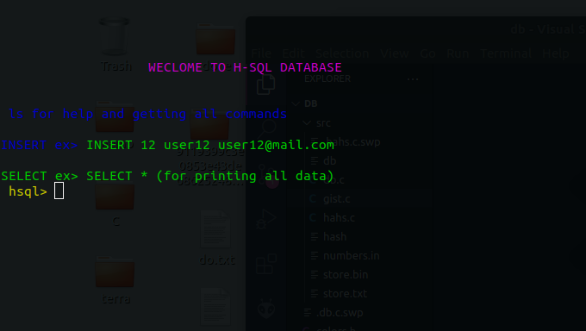

*Can we do it C++?*

## H-SQL DATABASE

<p align="center" >

</p>

#### A SQL DATABASE CLONE IN C (Balanced Tree)


#### Running the Database


```
git clone https://github.com/xadhrit/h-sql.git   

```
##### Compile db.c file

```
make

or 

chmod a+x run
./run

```

##### Running the db

```
./db <database filename>

```


## Commands:


Insertion--
```

hsql> INSERT  {key}, {username},{email}

```

Displaying data--

```

hsql> SELECT *

```

#### Use `EXIT` for EXITING THE PROGRAM


 
